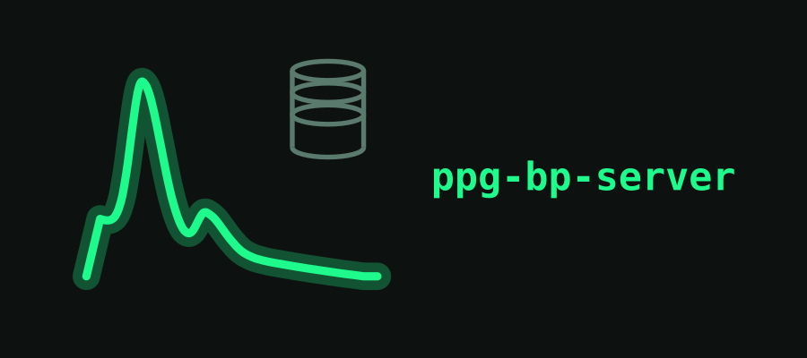

# ppg-bp-server

<p align="center">
  
</p>

Ingest server and analysis dashboard for the ppg-bp project. Runs wherever you want it — a Raspberry Pi, an old laptop, a desktop that's on most of the time — and receives session uploads from [ppg-bp-android](https://github.com/EliasVahlberg/ppg-bp-android) over plain HTTP on your own network.

Not a medical device. Read [DISCLAIMER.md](DISCLAIMER.md) first.

## What it does

The server accepts raw session bundles from the phone (staged files, SHA-256 integrity check) and converts them into a canonical DuckDB store using the ROP-format converter also used by [ppg-bp](https://github.com/EliasVahlberg/ppg-bp) (vendored into this repo under `src/ppg_pi_server/_vendor/`, so this server has no runtime dependency on that repo). It also accepts standalone blood-pressure-cuff readings, deduplicated by reading ID so the phone can safely re-upload its whole local store.

Auth is a bearer token per phone; there are no accounts, no cloud component, and nothing leaves your network unless you make it. The dashboard side is Plotly-based: daily and hourly longitudinal views, recording-coverage tracking (did the sensor actually capture data today, not just "was there a session"), signal-quality trends, and cuff-versus-PPG comparison. It runs as a systemd service, survives reboots, and logs everything to journald.

## Why self-hosted instead of a cloud service

This started as a single-patient tool. There's no multi-tenant use case to justify a hosted backend, and health data for a real person is exactly the kind of thing you don't want sitting on someone else's server by default. Point your phone at whatever machine is on your LAN; that's the whole deployment story.

## Architecture

```
[phone] --HTTP (LAN)--> [ingest server] --writes--> [DuckDB canonical store]
                              │                            ▲
                              │ on-ingest hook              │
                              ▼                            │
                        [dashboard] <-- reads derived tables
```

The ingest server and the dashboard are two separate processes against the same DuckDB file, deliberately kept apart so the lean ingest path doesn't need scipy/plotly as dependencies. They coordinate the one thing that matters — DuckDB allows one writer at a time — with a retry-with-backoff wrapper around every DB connection, since the dashboard's analysis refresh can hold a write lock for tens of seconds on a big dataset.

## Quick start

```bash
git clone https://github.com/EliasVahlberg/ppg-bp-server.git
cd ppg-bp-server
uv sync
uv run ppg-pi-server token add my-phone
uv run ppg-pi-server db init
uv run ppg-pi-server serve
```

Point your phone's `SET_SERVER` at `http://<this-machine's-LAN-IP>:8000` with the printed token, then sync.

## Running it persistently

A `systemd` user-service unit is included (`systemd/ppg-pi-server.service`). No root required:

```bash
cp systemd/ppg-pi-server.service ~/.config/systemd/user/
systemctl --user daemon-reload
systemctl --user enable --now ppg-pi-server
loginctl enable-linger $USER   # keep running after logout
```

Logs: `journalctl --user -u ppg-pi-server -f`. Every request is logged with method, path, status, and duration; every session conversion logs per-sensor sample counts and elapsed time; auth failures log the token prefix. Set `PPG_PI_SERVER_LOG_LEVEL=DEBUG` for per-file upload logging.

## Endpoints

| Method | Path | Auth | Purpose |
|--------|------|------|---------|
| GET | `/health` | none | Liveness |
| GET | `/` | none | Landing page, recent sessions |
| POST | `/api/v1/sessions` | bearer | Open a session (idempotent) |
| PUT | `/api/v1/upload/{uuid}/{filename}` | bearer | Stage one bundle file |
| POST | `/api/v1/sessions/{uuid}/complete` | bearer | Convert the staged bundle into the canonical store |
| GET | `/api/v1/sessions` | bearer | List recent sessions |
| POST | `/api/v1/cuff` | bearer | Upload cuff readings (deduped by reading ID) |

`GET /` is intentionally unauthenticated (it's the human-facing landing page) but does show recent session UUID prefixes, device names, and sample counts. That's low-sensitivity metadata, not health data, but it means anyone who can reach the port sees it. This server has no app-level access control of its own for that route; it relies entirely on network-layer isolation (Tailscale, or a LAN you trust) to keep it private. Don't expose the port beyond that without adding auth to `/` too.

## Hardware and sizing

The server is not CPU-bound in normal operation — ingest is file staging plus a DuckDB conversion, and the dashboard recomputes derived tables on demand. Storage is the real constraint, because raw per-sample data accumulates fast.

**Recommended baseline: Raspberry Pi 5, 8 GB RAM, 256 GB SSD** (USB-SSD or NVMe HAT, not an SD card — this is a sustained-append workload and SD cards wear out and corrupt under it).

RAM matters for the dashboard, not ingest: DuckDB analysis over a year of per-minute derived tables is comfortable on 8 GB and cramped on 4 GB. Ingest alone runs fine on 2 GB.

Storage, derived from the per-sample record sizes in `ppg-bp/docs/design/android_recorder.md` §6 (PPG 32 B, ACC/GYRO 24 B):

| Capture profile | Streams | Rate | Per hour |
|---|---|---|---|
| `calibration` | PPG 176 + ACC 416 + GYRO 416 Hz | 25.0 KB/s | ~92 MB/h |
| `monitor` | PPG 176 + ACC 52 Hz | 6.7 KB/s | ~25 MB/h |

For a representative deployment — 12 h/day on `monitor`, plus two 30-minute `calibration` sessions a week — that is roughly **310 MB/day of raw data**:

| Retention policy | Per month | Per year |
|---|---|---|
| Canonical DuckDB only (raw uploads pruned after conversion) | ~9 GB | ~112 GB |
| Raw upload backup kept alongside DuckDB (the default) | ~15 GB | ~179 GB |

So a 60 GB disk holds about 4 months at default settings, and 256 GB covers a year with headroom. The DuckDB figures above conservatively assume no compression gain over raw; actual columnar compression on this data has not been measured yet, so real usage is likely lower.

`PPG_PI_SERVER_UPLOAD_DIR` keeps raw staged bundles indefinitely as a hedge against DB corruption. That is the single biggest lever on disk usage — pruning it after successful conversion roughly cuts consumption by 40%, at the cost of losing the ability to re-derive the canonical store from scratch.

## Configuration

Env vars, prefix `PPG_PI_SERVER_`:

| Variable | Default | Purpose |
|----------|---------|---------|
| `PPG_PI_SERVER_DB_PATH` | `data/sessions.duckdb` | Canonical DuckDB store |
| `PPG_PI_SERVER_UPLOAD_DIR` | `data/uploads` | Raw staged bundles, kept as a backup against DB corruption |
| `PPG_PI_SERVER_TOKENS_FILE` | `data/tokens.json` | Bearer-token allowlist |
| `PPG_PI_SERVER_BIND_HOST` / `_BIND_PORT` | `127.0.0.1` / `8000` | Listen address. Loopback-only by default; set to your Tailscale interface IP (or `0.0.0.0` behind your own firewall) to actually receive uploads |
| `PPG_PI_SERVER_ANALYSIS_REFRESH_URL` | unset | If set, POSTs here after a sync completes to trigger dashboard recomputation |
| `PPG_PI_SERVER_LOG_LEVEL` | `INFO` | Set `DEBUG` for verbose per-request logging |

## Status

| Component | State |
|---|---|
| Session bundle ingest (stage, convert, canonical DuckDB) | Done. SHA-256 verified. |
| Cuff reading ingest | Done. Idempotent dedup. |
| Bearer-token auth | Done. |
| Systemd service | Done. Survives reboot, full request/error logging to journald. |
| Dashboard | Done. KPI cards, 7 preset longitudinal views, build-your-own plot panel. |
| DB lock-contention handling between ingest and dashboard refresh | Done. |
| HTTPS / remote access beyond LAN | Not started. LAN-only by design; adding Tailscale or similar is a future option, not required for the primary use case. |

## License

MIT — see [LICENSE](LICENSE).
